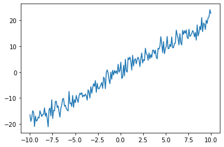
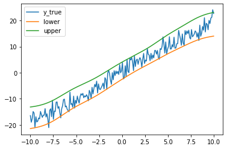
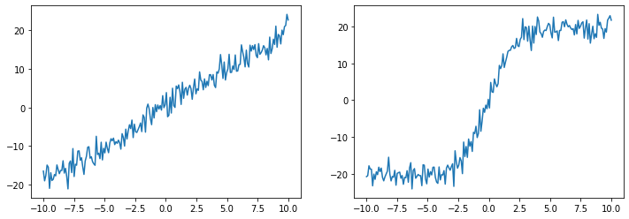
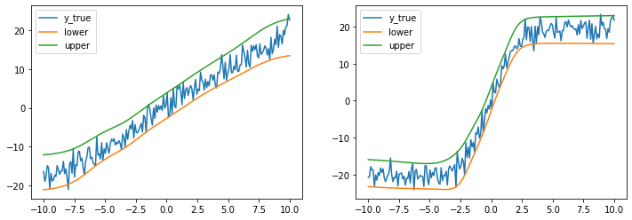

Getting Started
===============

Make sure you have installed `torchTS`

In the following example, we will use the `torchTS` package to train a simple LSTM model on a time-series datasets. We will also enable uncertainty quantification so that we can get prediction intervals.

1. First, we will import necessary package.

.. code-block:: python

    import torch
    import numpy as np
    import matplotlib.pyplot as plt

    from torchts.nn.models.lstm import LSTM
    from torchts.nn.loss import quantile_loss

1. Let's randomly generate a time-series dataset.

.. code-block:: python

    # generate linear time series data with some noise
    n = 200
    x_max = 10
    slope = 2
    scale = 2

    x = torch.from_numpy(np.linspace(-x_max, x_max, n).reshape(-1, 1).astype(np.float32))
    y = slope * x + np.random.normal(0, scale, n).reshape(-1, 1).astype(np.float32)

    plt.plot(x, y)
    plt.show()

We will get the following plots:

3. Then, we can start selecting and training our model. In this example, we will use LSTM model.

.. code-block:: python
    # model configs
    inputDim = 1
    outputDim = 1
    optimizer_args = {"lr": 0.01}
    # confidence level = 0.025
    quantile = 0.025
    batch_size = 10

    model = LSTM(
        inputDim,
        outputDim,
        torch.optim.Adam,
        criterion=quantile_loss,
        criterion_args={"quantile": quantile},
        optimizer_args=optimizer_args
    )
    model.fit(x, y, max_epochs=100, batch_size=batch_size)

1. After model is trained, we can use it to predict the future values. And more importantly, since we enable uncertainty quantification method, we can also get a prediction interval!

.. code-block:: python

    y_preds = model.predict(x)

5. Let's plot prediction results

.. code-block:: python

    plt.plot(x, y, label="y_true")
    plt.plot(x, y_preds, label=["lower", "upper"])
    plt.legend()
    plt.show()

Example prediction results for other datasets:
        

